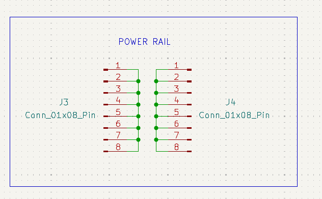
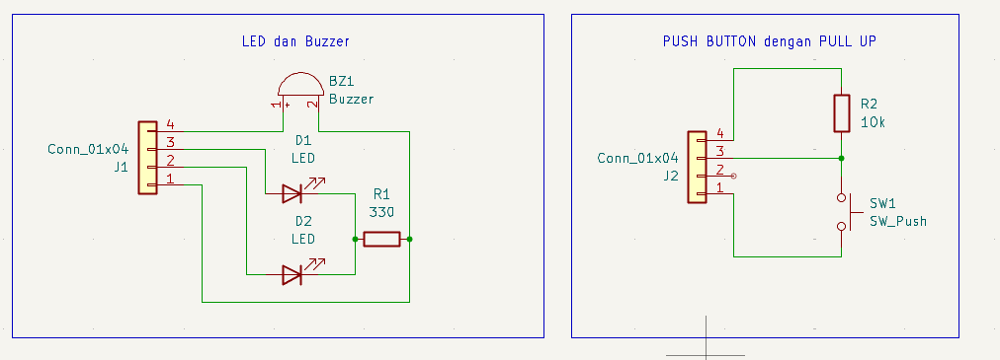
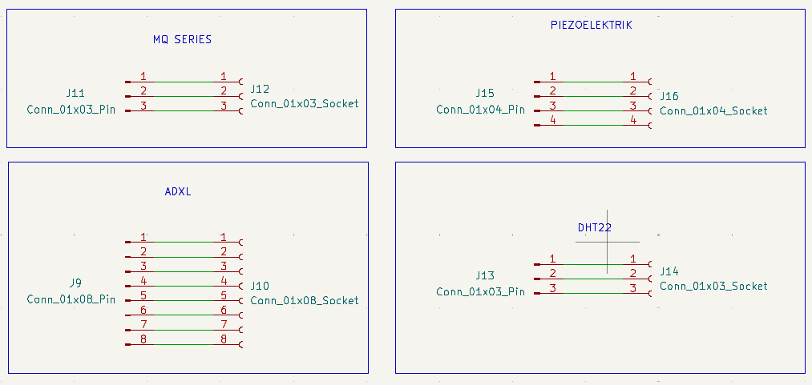
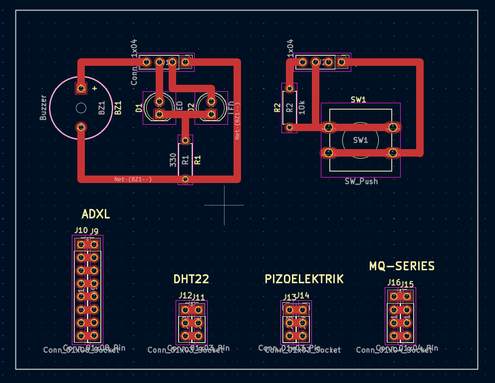
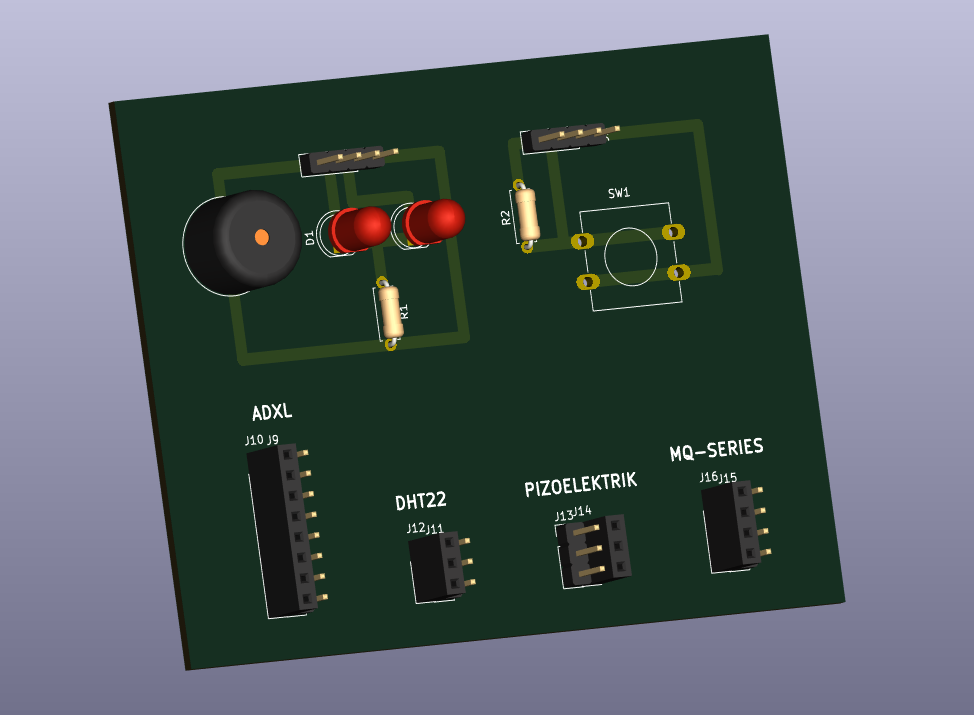
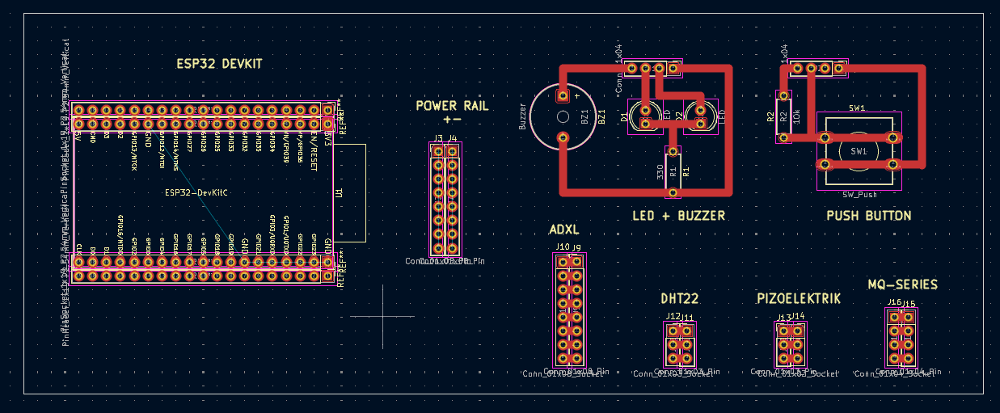
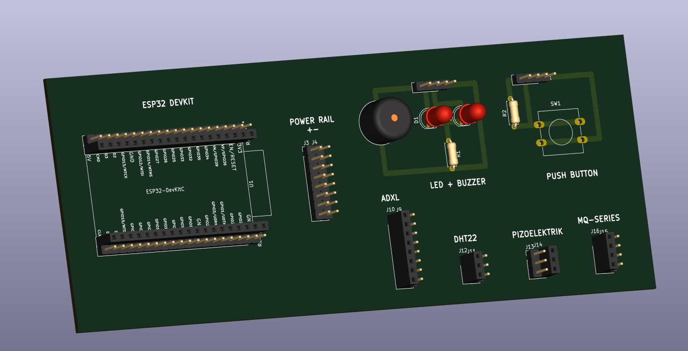

# Modul 1: Pengenalan Soldering 

## Tujuan
1. Memahami teknik dasar soldering pada PCB matrix hole
2. Mampu membuat pinheader grid untuk pendekatan readboard-style
3. Memahami prinsip safety dalam soldering
4. Mampu menggunakan standarisasi warna kabel untuk debugging mudah

## Alat dan Bahan

### Alat:
1. Solder dengan Mata solder tip conical atau chisel
2. Penjepit (tweezers)
3. Penyedot timah (solder sucker) atau solder wick
4. Multimeter untuk testing

### Bahan:
1. ESP32 development board (ESP32 DevKit)
2. Push button tactile switch
3. Buzzer 3.3V
4. 2x LED (warna bebas) dengan resistor 330Ω masing-masing
5. Sensor AHT21 untuk temperature dan humidity
6. PCB matrix hole (protoboard)
7. Kabel female jumper dupont 2.54mm (berwarna sesuai standar)
8. Pinheader male (1x40) - untuk grid dan rails
9. Pinheader female (1x40) - untuk socket ESP32 dan sensor
10. Timah solder (lead-free, diameter 0.8mm)
11. Fluks (flux) jika diperlukan

## Dasar Teori

### 1. Pengenalan Soldering dalam Elektronika
Soldering merupakan proses penyambungan komponen elektronik melalui fusi logam pengisi (solder alloy) yang meleleh pada suhu di bawah titik leleh logam dasar. Proses ini membentuk sambungan listrik dan mekanis yang permanen melalui pembentukan ikatan metalurgi antara solder dan permukaan logam. Berbeda dengan welding yang melelehkan logam dasar, soldering hanya melelehkan logam pengisi, sehingga komponen elektronik sensitif tidak mengalami kerusakan termal.

### 2. Material Soldering: Timah dan Komposisinya
Timah solder (solder alloy) merupakan campuran logam dengan komposisi yang menentukan karakteristik penyambungan. Dua kategori utama adalah:

**a. Timah mengandung timbal (Pb-Sn)**
- Komposisi umum: Sn63/Pb37 (63% timah, 37% timbal)
- Titik leleh eutektik: 183°C
- Kelebihan: fluiditas baik, joint mengkilap, mudah digunakan
- Kekurangan: toksisitas timbal, regulasi lingkungan

**b. Timah bebas timbal (Lead-free)**
- Komposisi umum: Sn96.5/Ag3.0/Cu0.5 (SAC305)
- Titik leleh: 217-220°C
- Kelebihan: ramah lingkungan, memenuhi regulasi RoHS
- Kekurangan: suhu lebih tinggi, fluiditas berkurang, joint kurang mengkilap

### 3. Peran Fluks dalam Proses Soldering
Fluks merupakan senyawa kimia yang berfungsi sebagai agen pembersih dan pencegah oksidasi selama proses soldering. Mekanisme kerja fluks meliputi:

1. **Aktivasi permukaan**: Menghilangkan lapisan oksida (SnO₂, CuO) melalui reaksi reduksi kimia
2. **Proteksi termal**: Membentuk lapisan pelindung yang mencegah oksidasi ulang
3. **Penurunan tegangan permukaan**: Meningkatkan wettability solder pada permukaan logam

Jenis fluks berdasarkan standar J-STD-004:
- **Rosin (R)**: Berbasis damar pinus, tidak korosif, residu non-konduktif
- **Water Soluble (OA)**: Berbasis asam organik, mudah dibersihkan, agresif
- **No-Clean (NC)**: Residu minimal, tidak perlu pembersihan pasca-soldering

### 3a. Peran Mata Solder dalam Proses Soldering
Mata solder (soldering iron tip) berfungsi sebagai media transfer panas dari solder station ke joint yang akan disolder. Konstruksi mata solder terdiri dari copper core dengan plating nikel atau besi untuk mencegah korosi. Pemilihan jenis mata solder yang tepat mempengaruhi efisiensi transfer panas dan presisi pekerjaan.

**Jenis-jenis Mata Solder:**
- **Conical**: Ujung runcing untuk pekerjaan presisi tinggi (SMD, fine-pitch)
- **Chisel**: Ujung pipih untuk transfer panas optimal (through-hole, power components)
- **Hoof**: Bentuk seperti kuku untuk drag soldering pada SMD components
- **Knife**: Untuk desoldering dan aplikasi khusus

**Faktor Pemilihan:**
1. **Thermal mass**: Kapasitas panas menentukan recovery time
2. **Contact area**: Luas kontak mempengaruhi kecepatan transfer panas
3. **Tip geometry**: Bentuk menentukan aksesibilitas ke joint
4. **Plating quality**: Ketahanan terhadap korosi dan oxidation

### 3b. Peran Suhu Mata Solder dalam Kualitas Joint
Suhu mata solder merupakan parameter kritis yang menentukan kualitas sambungan. Prinsip dasar melibatkan transfer panas yang cukup untuk melelehkan solder tanpa menyebabkan thermal damage pada komponen.

**Optimasi Suhu Berdasarkan Material:**
- **Timah leaded (Sn63/Pb37)**: 320-350°C (titik leleh 183°C)
- **Timah lead-free (SAC305)**: 350-380°C (titik leleh 217-220°C)
- **Komponen sensitif**: 300-320°C dengan waktu kontak minimal

**Efek Penyimpangan Suhu:**
- **Suhu terlalu rendah**: Incomplete melting, cold joint, poor wetting
- **Suhu terlalu tinggi**: Thermal stress pada komponen, oxidation cepat, degradasi flux
- **Suhu optimal**: Joint mengkilap, wetting sempurna, waktu kerja efisien

### 3c. Cold Joint: Masalah Umum dalam Soldering
Cold joint (sambungan dingin) merupakan defect soldering yang terjadi ketika solder tidak mencapai suhu yang cukup untuk membentuk ikatan metalurgi yang sempurna. Joint ini memiliki karakteristik visual buram (matte) dan struktur granular, berbeda dengan joint baik yang mengkilap seperti kaca.

**Ciri-ciri Cold Joint:**
1. **Penampilan visual**: Permukaan buram, tidak reflektif, tekstur granular
2. **Struktur mikro**: Kristal solder besar, kurangnya intermetallic layer
3. **Kinerja elektrik**: Resistansi tinggi, konduktivitas tidak konsisten
4. **Reliabilitas**: Rentan terhadap mechanical failure dan corrosion

**Penyebab Utama Cold Joint:**
1. **Suhu tidak adekuat**: Mata solder terlalu dingin untuk melelehkan solder sempurna
2. **Waktu kontak insufisien**: Penarikan solder sebelum pembentukan joint lengkap
3. **Gerakan selama pendinginan**: Disturbance saat solder masih dalam fase semi-solid
4. **Kontaminasi permukaan**: Oksida atau kotoran menghalangi wetting
5. **Insufficient flux**: Aktivasi permukaan tidak optimal

**Pencegahan Cold Joint:**
1. **Kalibrasi suhu**: Pastikan solder station dikalibrasi secara berkala
2. **Teknik "heat and feed"**: Panaskan joint terlebih dahulu, baru aplikasikan solder
3. **Waktu kontak optimal**: 2-3 detik untuk joint standar
4. **Stabilitas kerja**: Gunakan helping hand atau fixture untuk mencegah gerakan
5. **Surface preparation**: Bersihkan permukaan dengan isopropyl alcohol sebelum soldering
6. **Flux aplikasi**: Gunakan flux tambahan untuk joint yang challenging
7. **Visual inspection**: Periksa setiap joint dengan kaca pembesar setelah soldering

**Perbaikan Cold Joint:**
1. **Reflow dengan flux**: Tambahkan flux, panaskan ulang joint hingga solder meleleh sempurna
2. **Desoldering dan ulangi**: Hapus solder lama, bersihkan area, solder ulang dengan teknik benar
3. **Solder wick**: Gunakan solder wick untuk menghapus solder defective
4. **Quality verification**: Test continuity dan visual inspection setelah perbaikan

### 4. Breadboard: Platform Prototyping Elektronika
Breadboard (protoboard) merupakan platform prototyping yang memanfaatkan sistem koneksi internal spring-loaded untuk menghubungkan komponen elektronik tanpa proses soldering. Struktur internal breadboard terdiri dari:

- **Power rails**: Jalur vertikal untuk distribusi VCC dan GND
- **Terminal strips**: Jalur horizontal 5-pin untuk koneksi komponen
- **Center gap**: Pemisah untuk integrated circuits (ICs)

Prinsip kerja breadboard didasarkan pada kontak mekanis antara pin komponen dan pegas logam di dalamnya, membentuk sambungan listrik sementara dengan resistansi kontak sekitar 20-50 mΩ.

### 5. Kelemahan Breadboard dalam Prototyping Lanjutan
Meskipun breadboard sangat efektif untuk prototyping awal dan pembelajaran, terdapat beberapa limitasi signifikan dalam aplikasi praktis:

1. **Stabilitas koneksi**: Kontak spring-loaded rentan terhadap vibrasi dan perubahan suhu, menyebabkan intermittent connection
2. **Parasitik elektrik**: Kapasitansi parasit antar jalur (2-25 pF) dan induktansi seri mempengaruhi performa frekuensi tinggi (>10 MHz)
3. **Resistansi kontak variabel**: Fluktuasi resistansi (20-200 mΩ) menyebabkan drop voltage tidak konsisten pada aplikasi daya
4. **Limitasi arus**: Konstruksi internal membatasi arus maksimal (~1A), tidak cocok untuk aplikasi daya tinggi
5. **Noise dan crosstalk**: Isolasi yang buruk antara jalur menyebabkan coupling noise pada sinyal sensitif

### 6. Transisi ke Pendekatan Hybrid: Breadboard-style pada PCB
Untuk mengatasi limitasi breadboard sambil mempertahankan fleksibilitas prototyping, dikembangkan pendekatan hybrid yang mengombinasikan keunggulan breadboard dengan reliabilitas PCB. Konsep ini melibatkan:

**Traditional vs Breadboard-style**:
- **Traditional**: Komponen disolder langsung ke PCB (permanen, sulit debugging)
- **Breadboard-style**: Hanya pinheader yang disolder, komponen dihubungkan dengan jumper (fleksibel, mudah debugging)

**Manfaat Pendekatan Ini**:
1. **Mudah debugging**: Cukup ganti kabel jika ada masalah koneksi
2. **Prototyping cepat**: Komponen bisa dipindah-pindah dengan mudah
3. **Reusable**: PCB bisa digunakan untuk multiple projects
4. **Learning friendly**: Memahami koneksi rangkaian dengan jelas

### Standarisasi Warna Kabel
**Sistem Warna untuk Debugging Mudah**:
- **Merah**: VCC (3.3V Power Supply)
- **Hitam**: GND (Ground)

Jika memungkinkan pakai:
- **Kuning**: SDA (I2C Data Line)
- **Hijau**: SCL (I2C Clock Line)
- **Biru**: GPIO Output (untuk LED, Buzzer)
- **Orange**: GPIO Input (untuk Button, Sensor)
- **Putih/Kuning**: GPIO lainnya

**Manfaat Standarisasi**:
1. Identifikasi fungsi kabel dengan cepat
2. Memudahkan troubleshooting
3. Konsistensi antar kelompok
4. Professional look

## Praktikum Soldering

### Prinsip Dasar Praktikum
Praktikum ini mengimplementasikan teori soldering yang telah dijelaskan pada bagian **Dasar Teori**. Fokus utama adalah penerapan teknik soldering yang benar untuk membuat platform prototyping hybrid yang menggabungkan keandalan PCB dengan fleksibilitas breadboard.

### Safety Praktikum Soldering
1. **Kacamata safety**: Lindungi mata dari percikan timah panas
2. **Ventilasi adekuat**: Hindari inhalasi asap flux dengan bekerja di area berventilasi baik
3. **Penanganan alat panas**: Gunakan holder untuk solder station, jangan sentuh mata solder (350°C)
4. **Prosedur shutdown**: Matikan solder station setelah penggunaan, biarkan dingin sebelum disimpan
5. **Higiene pasca-praktikum**: Cuci tangan dengan sabun setelah handling solder, terutama jenis mengandung timbal

## Layout PCB Breadboard-style

### Desain Pinheader Grid:
1. **VCC Rails**: 2 baris pinheader untuk distribusi 3.3V (gunakan kabel merah)
2. **GND Rails**: 2 baris pinheader untuk ground (gunakan kabel hitam)
3. **GPIO Grid**: Multiple pinheader untuk koneksi komponen
4. **ESP32 Socket**: Pinheader female untuk mudah pasang/lepas ESP32
5. **Sensor Header**: Pinheader female khusus untuk sensor AHT21

### Visual Layout:

*Gambar 1: Layout pinheader grid pada PCB matrix hole*

## Prosedur Praktikum

### Persiapan
1. Siapkan semua alat dan bahan di meja kerja
2. Nyalakan solder station dan set suhu ke 350°C
3. Bersihkan mata solder dengan sponge basah
4. Siapkan kabel jumper dengan warna sesuai standar

### Step 1: Solder VCC & GND Rails
1. Potong pinheader male untuk rails VCC dan GND
2. Pasang di PCB: 2 baris untuk VCC (atas), 2 baris untuk GND (bawah)
3. Solder dengan hati-hati, pastikan joint mengkilap
4. **Tips**: Gunakan kabel merah dan hitam sebagai visual guide

### Step 2: Solder GPIO Grid
1. Buat grid pinheader untuk koneksi komponen
2. Spacing konsisten (2.54mm standard)
3. Solder setiap pinheader dengan waktu 2-3 detik per joint
4. **Quality check**: Tidak ada solder bridge, semua joint mengkilap

### Step 3: Solder ESP32 Socket
1. Gunakan pinheader female untuk socket ESP32
2. Pasang di area tengah PCB, align dengan pinout ESP32
3. Solder dengan presisi (pin female lebih kecil)
4. **Testing**: Coba pasang ESP32, pastikan fitting baik

### Step 4: Solder Sensor Header
1. Pinheader female untuk sensor AHT21
2. 4-pin header: VCC, GND, SDA, SCL
3. Solder dengan orientasi yang benar
4. **Labeling**: Gunakan marker untuk identifikasi pin

### Step 5: Quality Check & Testing
1. **Visual inspection**: Joint mengkilap, tidak buram
2. **Multimeter test**: 
   - Cek continuity setiap sambungan
   - Test short circuit antara VCC dan GND
   - Pastikan tidak ada solder bridge
3. **ESP32 test**: Pasang ESP32, pastikan semua pin terkoneksi
4. **Kabel test**: Test kabel jumper dengan multimeter

## Tips Soldering yang Baik
1. **Waktu**: 2-3 detik per joint (jangan terlalu lama)
2. **Suhu**: 320-350°C untuk timah lead-free
3. **Jumlah Timah**: Cukup untuk menutupi joint, tidak berlebihan
4. **Kualitas Joint**: Mengkilap seperti kaca, tidak buram (cold joint)
5. **Solder Bridge**: Pastikan tidak ada sambungan tidak sengaja antara pin

## Persiapan untuk Modul 2
**Setelah Soldering Selesai**:
1. ESP32 sudah terpasang di socket
2. Siapkan kabel jumper dengan warna sesuai standar:
   - Merah: VCC ke sensor, LED, buzzer
   - Hitam: GND ke semua komponen
   - Kuning: SDA (GPIO 21) ke sensor
   - Hijau: SCL (GPIO 22) ke sensor
   - Biru: GPIO output ke LED dan buzzer
   - Orange: GPIO input dari button
3. Test semua koneksi dengan multimeter

## Kesimpulan
1. Pendekatan breadboard-style memudahkan debugging dan prototyping
2. Standarisasi warna kabel meningkatkan efisiensi troubleshooting
3. Quality soldering adalah keterampilan yang perlu latihan
4. Safety selalu menjadi prioritas utama
5. PCB yang dibuat reusable untuk project lainnya

## Referensi
1. IPC-A-610: Acceptability of Electronic Assemblies
2. NASA Workmanship Standards
3. "The Art of Electronics" - Paul Horowitz
4. Panduan soldering dari produsen solder station
5. ESP32 Official Documentation: docs.espressif.com
